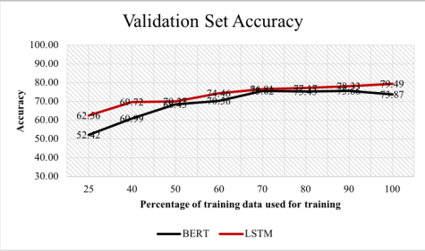

# 6.S898 Final Project - LSTM vs Transformers for Time Series Modeling

By Miranda Cai and Roderick Huang

## 1. Introduction
In the context of time series forecasting, comparing Long Short-Term Memory (LSTM) networks to Transformers is a fascinating exploration into the evolution of deep learning architectures. Despite having distinct strengths and approaches, both LSTM and transformer models have revolutionized natural language processing (NLP) and sequential data tasks. 

LSTMs, with their recurrent structure, were pioneers in capturing long-range dependencies in sequential data. While the accuracy of such models have been shown to be quite effective in many applications, training LSTM models takes a relatively long time because of the fact that they must remember all past observances. One faster alternative to LSTM models are transformers. Transformers are able to remember only the important bits of inputs using an attention-mechanism, and is also parallelizable making it much faster to train than recursive LSTMs that must be processed sequentially. 

With its recent development, people have started opting to use transformer based models to solve sequence problems that once relied on LSTMs. One significant example is for NLP use cases, where transformers can process sentences as a whole rather than by individual words like LSTMs do. However, since transformers have been around for less than a decade, there are still many potential applications that are yet to be deeply explored. Thus, we will explore the effectiveness of transformers specifically for time series forecasting which finds applications across a wide spectrum of industries including finance, supply chain management, energy, etc. 

Our goal is to realize which particular features of time series datasets could lead transformer-based models to outperform LSTM models. 

## 2. Related Work

With the growth of ChatGPT in the recent years, extensive research has been done across various NLP tasks such as language modeling, machine translation, sentiment analysis, and summarization, each aiming to provide comprehensive insights into when each architecture excels and where their limitations lie. While research on time series data exists, it hasn't garnered as much attention, so we aim to broaden this area of study.

### 2.1 Effect of Dataset Size
The size of a dataset plays an important role in the performance of an LSTM model versus a transformer model. A study [[1]](#1) done in the NLP field compared a pre-trained BERT model with a bidirectional LSTM on different language dataset sizes. They experimentally showed that the LSTM accuracy was higher by 16.21% relative difference with 25% of the dataset versus 2.25% relative difference with 80% of the dataset. This makes sense since BERT is a robust transformer architecture that performs better with more data. As shown in the figure below from [[1]](#1), while LSTM outperformed BERT, the accuracy difference gets smaller as the perctange of training data used for training increases.

  

While we perform a similar methodology which is discussed further in section 4.1, the major difference is in the type of data we test. Instead of measuring classification accuracy for NLP tasks, this study measures the mean squared error (MSE) loss for regression time series data. 

### 2.2 Effect of Noisy Datasets

Theoretically, LSTMs are more robust to noisy data due to its ability to capture local dependencies. On the other hand, the self-attention mechanisms in transformers propagate errors and may struggle with sequences that have a high degree of noise. Electronic traders have been recently attempting to apply transformer models in financial time series prediction to beat LSTMs [[2]](#2). Largely focused on type of assets, the research showed that transformer models have limited advantage in absolute price sequence prediction. In other scenarios like price difference and price movement, LSTMs had better performance.

Financial data sets are known to be extremely noisy, and in addition, very hard to find due to their confidential nature. The application of [[2]](#2) gave inspiration to study how the "amount" of noisiness would affect the LSTM and transformer models. Discussed further in section 4.2, this study added various amounts of noise to a clean dataset to see how this would affect each architecture.

## 3. Dataset

## 4. Experimental Results and Discussion

## 5. Conclusion

## 6. References
<a id="1">[1]</a> 
A. Ezen-Can, “A comparison of lstm and bert for small corpus,” arXiv preprint arXiv:2009.05451, 2020.
<a id="1">[2]</a> 
P. Bilokon and Y. Qiu, “Transformers versus lstms for electronic trading,” arXiv preprint arXiv:2309.11400, 2023.